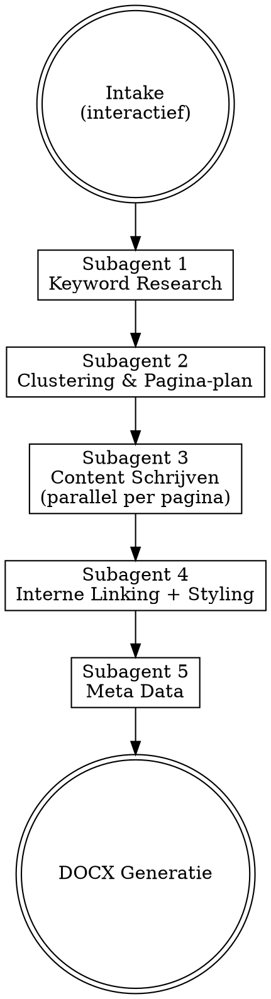

# SEO Content Cluster

Multi-subagent skill that transforms a focus cluster into fully written,
SEO-optimized content pages delivered as DOCX files.

## Intake Flow

Before any subagent starts, ask these questions interactively (one at a time):

1. **Domein** — e.g. `glowgolf.nl`
2. **Focuscluster** — e.g. "airco" or "wat te doen in scheveningen"
3. **Pad voor nieuwe pagina's** — e.g. `/blog/` or `/scheveningen/`
4. **Doelgroep** — e.g. "huiseigenaren" or "toeristen"
5. **Taal** — e.g. Nederlands, Engels
6. **Concurrenten** (optioneel) — e.g. `concurrent1.nl, concurrent2.nl`
7. **Ahrefs data** — Check if Ahrefs MCP is available. If not, ask:
   "Ahrefs MCP is niet beschikbaar. Heb je een Ahrefs Keywords Explorer
   CSV-export? Zo ja, geef het pad op. Zo nee, kan ik niet verder."
8. **GSC data** — Check if Windsor has a GSC connector for the domain.
   If not, ask: "GSC is niet gekoppeld via Windsor. Heb je een GSC
   CSV-export (Performance report)? Zo ja, geef het pad op. Zo nee,
   werk ik zonder positiedata."

**Brand guide:** Load from `~/.claude/brands/{projectnaam}/`. Read all files
in the directory. If directory is missing or empty, ask the user to provide
one first and STOP.

## Data Sources & Fallbacks

**CRITICAL: NEVER fabricate keyword data. If a data source is unavailable,
use the fallback. If no fallback data is provided, STOP and ask the user.**

### Ahrefs (keyword research)
1. **Primary:** Ahrefs MCP tools (if available — check with ToolSearch first)
2. **Fallback:** Ask the user to upload an Ahrefs CSV export. The user exports
   from Ahrefs Keywords Explorer and provides the file path. Parse the CSV
   to extract: keyword, volume, KD, CPC.
3. **If neither available:** STOP. Tell the user: "Ahrefs MCP is niet
   beschikbaar en er is geen export aangeleverd. Lever een Ahrefs CSV-export
   aan of koppel Ahrefs MCP."

### Google Search Console (current rankings)
1. **Primary:** Windsor MCP (`get_connectors` → `get_fields` → `get_data`)
2. **Fallback:** Ask the user to upload a GSC CSV export (Performance report).
3. **If neither available:** Continue without position data — mark all
   positions as "Onbekend" in keyword-research.md. Subagent 2 skips
   kannibalisatie check. Subagent 4 uses sitemap URLs only for internal linking.

### Sitemap
1. **Primary:** WebFetch from `{domein}/sitemap.xml`
2. **Fallback:** Ask the user to provide sitemap URL or upload sitemap file.
3. **If neither available:** Subagent 4 skips internal linking to existing pages,
   only cross-links between new pages.

## Subagent Pipeline



All steps are sequential. Only subagent 3 runs in parallel (one subagent
per page).

---

### Subagent 1 — Keyword Research

**Type:** `general-purpose`

**Prompt template:**
```
You are an SEO keyword researcher. Your task:

Domain: {domein}
Focus cluster: {focuscluster}
Language: {taal}
Competitors (optional): {concurrenten}

CRITICAL: NEVER fabricate or estimate keyword data. Only use real data from
tools or uploaded exports. If no data source is available, STOP and report.

Step 1 — Ahrefs keyword data:
Option A (MCP): Use ToolSearch to check if Ahrefs MCP tools are available.
  If yes: use `doc` tool first, then research keywords for "{focuscluster}"
Option B (CSV export): If Ahrefs MCP unavailable, check if user provided
  a CSV export path. If yes: read the CSV and parse keyword, volume, KD, CPC.
Option C: If neither available, STOP. Write to the output file:
  "BLOCKED: Geen Ahrefs data beschikbaar. Lever een CSV-export aan."

Step 2 — GSC current rankings:
Option A (Windsor): Call mcp__claude_ai_Windsor__get_connectors to find GSC
  connector for {domein}. Then get_fields, then get_data for queries related
  to "{focuscluster}".
Option B (CSV): If Windsor unavailable or domain not connected, check if user
  provided a GSC export. If yes: parse it.
Option C: If neither available, mark all positions as "Onbekend".

Step 3 — Combine and output:
Write results to output/{projectnaam}/{cluster}/keyword-research.md as a table:

| Keyword | Volume | KD | CPC | Current Position | Current URL | Intent |
|---------|--------|----|-----|-----------------|-------------|--------|

Intent = informational / transactional / navigational (determine from keyword)
Include a "Data Sources" section at top documenting which sources were used.
```

---

### Subagent 2 — Clustering & Pagina-plan

**Type:** `general-purpose`

**Prompt template:**
```
You are an SEO content strategist. Your task:

Domain: {domein}
Focus cluster: {focuscluster}
URL path: {pad}
Target audience: {doelgroep}
Language: {taal}

Inputs:
- Keyword research: Read output/{projectnaam}/{cluster}/keyword-research.md
- Brand guide: Read ~/.claude/brands/{projectnaam}/ (all files)
- SEO guidelines: Read ~/.claude/skills/seo-content-cluster/references/seo-guidelines.md

Step 1 — Download sitemap:
Use WebFetch to get {domein}/sitemap.xml (follow sitemap index if needed).
Parse all URLs. Filter to only URLs under {pad} (e.g. /scheveningen/*).
Save this filtered list as "existing_urls" for kannibalisatie check.

Step 2 — Cluster keywords into pages:
- Group keywords by search intent and semantic similarity
- Each page gets: 1 primary keyword + 2-5 secondary keywords
- One page per distinct search intent
- IMPORTANT: Clustering depends on expected content length (determined in Step 4).
  After Step 4, revisit clusters and check: if a page's target length is short
  (under ~800 words), there may not be enough room to properly cover all secondary
  keywords. In that case, split secondary keywords with meaningful volume into
  their own page so each topic gets enough depth to rank well.

Step 3 — Kannibalisatie check (TWO layers):

Layer A — GSC ranking check:
For each proposed page, check keyword-research.md for existing rankings:
- Current position 1-10: DO NOT create new page, note "optimize existing" in plan
- Current position 11-30: evaluate merge vs differentiate, note recommendation
- No current ranking: proceed to Layer B

Layer B — Sitemap slug check (catches pages GSC missed):
For each proposed page that passed Layer A:
- Take the primary keyword slug (e.g. "bedrijfsuitje-scheveningen")
- Search existing_urls for any URL containing the keyword root words
  (e.g. "bedrijfsuitje" matches "/scheveningen/bedrijfsuitjes/")
- Also check singular/plural variants and partial matches
- If a matching URL is found: WebFetch that page, read its H1 and content
- If the existing page covers the same topic: mark as "optimize existing: {url}"
- If the existing page has a different angle: note "evaluate: {url}" with explanation

CRITICAL: Both layers must pass before marking a page as "new".
A page is only "new" if there is NO existing ranking AND NO matching URL in sitemap.

Step 4 — Determine content length + revisit clusters:
For each page's primary keyword, use WebFetch to check top 3 ranking pages.
Estimate word count. Target: match or exceed by 10-20%. Minimum: 800 words.

After determining content length, revisit each cluster from Step 2:
- If target length is short (under ~800 words): check if secondary keywords have
  enough volume (e.g. >100/mnd) to justify their own page. A short page cannot
  properly cover multiple distinct topics — split them out so each gets enough
  depth and dedicated heading structure to rank.
- If target length is long (1200+ words): combining secondary keywords is fine,
  there is enough room for dedicated sections per keyword.

Step 5 — Generate URLs:
Format: {domein}{pad}{keyword-slug}
Slug = primary keyword, lowercase, spaces to hyphens, no special chars.

Output: Write to output/{projectnaam}/{cluster}/pagina-plan.md:

| # | URL | Primary KW | Secondary KWs | Intent | Target Length | Status |
|---|-----|-----------|---------------|--------|---------------|--------|

Status = "new" or "optimize existing: {url}" or "evaluate: {url}"
```

---

### Subagent 3 — Content Schrijven (parallel)

**Type:** `general-purpose` — spawn one per page from pagina-plan where Status = "new"

**Prompt template (per page):**
```
You are an SEO content writer. Write one page.

Page assignment:
- URL: {url}
- Primary keyword: {primary_kw}
- Secondary keywords: {secondary_kws}
- Search intent: {intent}
- Target length: {target_length} words
- Language: {taal}
- Target audience: {doelgroep}

Brand guide: Read ~/.claude/brands/{projectnaam}/ — follow tone, style, vocabulary.
SEO guidelines: Read ~/.claude/skills/seo-content-cluster/references/seo-guidelines.md

Writing rules:
- H1 contains primary keyword exactly
- H2s and H3s use secondary keywords naturally
- Keyword density: primary 1-2%, secondary 0.5-1%
- If any secondary keywords are questions with search volume:
  add FAQ section with exact question as heading, answer immediately
  visible in first sentence after the heading
- Short paragraphs (max 3-4 sentences)
- Write in {taal}, following brand guide tone
- No italic/emphasis in body text
- No bold in running paragraphs
- Match or exceed {target_length} words

CRITICAL — Natural Dutch language:
- Keywords MUST be woven into grammatically correct, natural Dutch sentences
- Add prepositions (in, van, voor, bij) where Dutch grammar requires them
- BAD: "Ontdek de beste activiteiten Scheveningen"
- GOOD: "Ontdek de beste activiteiten die Scheveningen te bieden heeft"
- Read each sentence out loud — if it sounds unnatural, rewrite it

CRITICAL — Capitalization:
- Headings: only first word + proper nouns (place names, brand names) capitalized
- BAD: "Uitje Scheveningen voor Vriendengroepen en Koppels"
- GOOD: "Uitje Scheveningen voor vriendengroepen en koppels"
- This applies to H1, H2, H3, and all text

Output: Write content as Markdown to output/{projectnaam}/{cluster}/paginas/{slug}.md
```

---

### Subagent 4 — Interne Linking + Styling

**Type:** `general-purpose`

**Prompt template:**
```
You are an SEO internal linking specialist. Your task:

Domain: {domein}
Project: {projectnaam}
Cluster: {cluster}

Inputs:
- Written pages: Read all .md files in output/{projectnaam}/{cluster}/paginas/
- Keyword research: Read output/{projectnaam}/{cluster}/keyword-research.md
- SEO guidelines: Read ~/.claude/skills/seo-content-cluster/references/seo-guidelines.md

Step 1 — Get existing page ranking data:
Use Windsor MCP (GSC connector) to get ranking data for all pages on {domein}.
For each existing page: which keywords does it rank for?

Step 2 — Find internal link opportunities:
For each written page:
- Find 3-5 existing pages on {domein} that are semantically related
- Use the GSC ranking keywords to determine the best anchor text
- Anchor text = keyword the destination page ranks for (or natural variation)
- Insert links as markdown: [anchor text](https://{domein}/path)
- Max 1 link per paragraph, place early where possible

Step 3 — Also cross-link between new pages where relevant.

Step 4 — Fix styling in all pages:
- Remove all *italic* and _italic_ from body text
- Remove all **bold** from running paragraphs
- Bold is only allowed in lists, tables, and headings
- Ensure clean heading hierarchy (H1 > H2 > H3, no skips)

Output: Overwrite each .md file in output/{projectnaam}/{cluster}/paginas/ with
the updated version including internal links and clean styling.
```

---

### Subagent 5 — Meta Data

**Type:** `general-purpose`

**Prompt template:**
```
You are an SEO meta data specialist. Your task:

Inputs:
- Page plan: Read output/{projectnaam}/{cluster}/pagina-plan.md
- Written pages: Read all .md files in output/{projectnaam}/{cluster}/paginas/
- SEO guidelines: Read ~/.claude/skills/seo-content-cluster/references/seo-guidelines.md

For each page in the plan with status "new", create:

Meta title:
- Max 60 characters
- Primary keyword at the start
- Brand name at the end
- Format: "{Primary Keyword} | {Brand}" or "{Primary Keyword} - {Context} | {Brand}"

Meta description:
- Max 155 characters
- Include primary keyword
- Include a call-to-action
- Compelling and click-worthy

Capitalization rule: only first word + proper nouns (place names, brand names).
- GOOD: "Bedrijfsuitje Scheveningen - teamuitje boeken | GlowGolf"
- BAD: "Bedrijfsuitje Scheveningen - Teamuitje Boeken | GlowGolf"

Output: Write to output/{projectnaam}/{cluster}/meta-data.md with TWO tables:

Table 1 — Meta data:
| URL | Meta Title | Chars | Meta Description | Chars |
|-----|-----------|-------|-----------------|-------|

Table 2 — Keyword tracking per page (for agency QA):
| URL | Keyword | Type | Volume | Count in text |
|-----|---------|------|--------|---------------|

Type = "primary" or "secondary". Count = number of times keyword appears in
the final content. This allows the agency to verify keyword integration.
```

---

### DOCX Generation (final step, run by orchestrator)

After all subagents complete, for each page:

1. Read meta data from `output/{projectnaam}/{cluster}/meta-data.md`
2. Build keyword JSON from the keyword tracking table for this page:
   `[{"keyword":"...", "type":"primary", "volume":500, "count":13}, ...]`
3. Run conversion script:

```bash
py ~/.claude/skills/seo-content-cluster/scripts/md-to-docx.py \
  "output/{projectnaam}/{cluster}/paginas/{slug}.md" \
  "output/{projectnaam}/{cluster}/paginas/{slug}.docx" \
  --meta-title "{meta_title}" \
  --meta-description "{meta_description}" \
  --keywords '[{"keyword":"...","type":"primary","volume":500,"count":13}]'
```

4. Confirm all DOCX files are created

## Output Structure

```
output/{projectnaam}/{cluster}/
  ├── keyword-research.md
  ├── pagina-plan.md
  ├── meta-data.md
  └── paginas/
      ├── {slug-1}.md
      ├── {slug-1}.docx
      ├── {slug-2}.md
      ├── {slug-2}.docx
      └── ...
```

## Reference Files

Load on-demand, NOT at startup:
- `references/seo-guidelines.md` — SEO rules for density, linking, meta, kannibalisatie, styling
